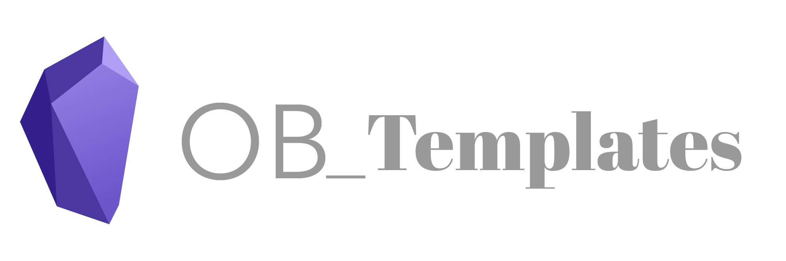

# Index
- [1. What is Obsidian?](#1-what-is-obsidian)
- [2. Description](#2-description)
- [3. Usage](#3-usage)
- [4. FAQ](#4-faq)
- [5. Special Thanks](#5-special-thanks)

# 1. What is Obsidian?
**The human brain is non-linear: we jump from idea to idea, all the time. Your second brain should work the same.**

In Obsidian, the making and following of connections is frictionless. **Tend to your notes like a gardener;** at the end of the day, sit back and marvel at your own knowledge graph.

- [Official Obsidian Website](https://obsidian.md)

# 2. Description
The project *OB_Templates* is an <a href="https://obsidian.md/">Obsidian</a> template repository.

Since the start of the project, there have been many changes. Since the beginning, it is a gathering place for my templates. Soon after, it became a project aimed at onboarding new users to <a href="https://obsidian.md/">Obsidian</a> - with a very important rule. **All templates must use only the core plugins of Obsidian**

In time, we found that the plugin <a href="https://github.com/blacksmithgu/obsidian-dataview">DataView</a> became an essential tool for every user. **The goal of the project is to keep it as basic as possible, so as to not confuse new users.**

All the available templates are not designed to be perfect. They are intended to be used as a reference for any user to build on them, or to inspire when building new templates.

# 3. Usage
*OB_Templates* is not a vault template, this is simply a folder of templates to be added in your vault. 

You can add the templates to your vault in different ways:
1. Download the repository, extract the files and add to your vault.
2. Go to a specific template and copy the text (Make sure you open in raw mode) and copy the text to a file in your vault.

# 4. FAQ
1. **Q:** How may I add the templates?
**A:** Simply copy the templates folder (`\templates\` or `\99 - Templates\`), or the specific template file to your vault.

2. **Q:** How may I use the templates?
**A:** As a general rule, most templates need to be *imported*. In other words, make sure you have at least the `Obsidian native templates` option enabled and configured.

3. **Q:** May I contribute to the repository?
**A:** YES! You are free to submit any template you use.

4. **Q:** May I clone the repository?
**A:** Yes, just make sure to leave the credits.

5. **Q:** Are there any prerequisite plugins to use the templates?
**A:** Yes.

#### Required plugins:
  - <a href="https://github.com/blacksmithgu/obsidian-dataview">DataView</a>
  - <a href="https://github.com/tgrosinger/advanced-tables-obsidian">Advanced Tables</a>

#### Recommended plugins: 
  - <a href="https://github.com/Aidurber/obsidian-plugin-dynamic-toc">Dynamic Table of Contents</a>.

6. **Q:** What is the meaning of the Tags?`
**A:** All the Tags in the templates are just examples. You may add or remove any Tags you would like. To learn more: <a href="https://help.obsidian.md/How+to/Working+with+tags">how to work with Tags in Obsidian</a>.

7. **Q:** My question/issue is not listed here, how may I get an answer?`
**A:** For any queries please head to the Obsidian forum and check the <a href="https://forum.obsidian.md/t/obsidian-notes-template/28940">OB_Template Thread</a>.

# Special Thanks
Order of credits are not reflective of the significance of listed contributions.

- <a href="https://github.com/llZektorll">Hugo Santos</a> - Creator of the original repository.
- <a href="https://github.com/portellam">Alex Portell</a> - Maintainer of this forked repository, refactoring and grammatical changes (with respect to American English).
- <a href="https://github.com/FeFoe">Felix Förster</a> - Misplaced link correction.
- <a href="https://github.com/kaleblub">Kaleb</a> - Added links to all plugin that are mentioned on the project as well as corrected some typos.
- <a href="https://github.com/dbarenholz">Daniel Barenholz</a> - The template <a href="https://github.com/llZektorll/OB_Template/blob/main/0A_Templates/0A_17_WordDictionary/0A_17_1_WordDictionary.md">Word Dictionary</a> was created based on a conversation we had on Discord out of my need to create a dictionary for acronyms. Hero Achievement ✨